<h1 align="center">Hi, I'm Piragash 👋</h1>

  <strong>Full-Stack &amp; Mobile Developer</strong> 
  I build web &amp; mobile applications that solve real problems for real customers.

---

## About Me

I'm a full-stack and mobile developer passionate about turning real customer challenges into clean, functional applications. I specialise in cross-platform products — from web dashboards to native mobile apps — using modern TypeScript ecosystems. Whether it's a delivery logistics platform or a personal finance tracker, I focus on shipping solutions that genuinely serve users.

---

## Featured Projects

<!-- | Project | Platform | What it solves |
|---------|----------|----------------|
| [Delivera](https://github.com/PiragashSelvaratnam/delivera-front) | Web · Next.js | Delivery tracking & logistics management for businesses |
| [Delivera Mobile](https://github.com/PiragashSelvaratnam/delivera-mobile) | iOS & Android · Expo | On-the-go delivery tracking for drivers & customers |
| [Daily Expense Tracker](https://github.com/PiragashSelvaratnam/daily-expense-tracker) | iOS & Android · Expo | Personal finance management with spending insights |
| [piragash.me](https://github.com/PiragashSelvaratnam/piragash-me) | Web · Next.js | Personal portfolio & project showcase | -->

---

## Tech Stack

---

<!-- MINESWEEPER_START -->
## 🎮 Minesweeper

> Click a cell to reveal it — help clear the board without hitting a mine!
> Clicking opens a pre-filled GitHub Issue, just submit it to make your move.

|   | A | B | C | D | E | F | G | H | I |
|---|:---:|:---:|:---:|:---:|:---:|:---:|:---:|:---:|:---:|
| **1** | [⬜](https://github.com/PiragashSelvaratnam/PiragashSelvaratnam/issues/new?title=minesweeper+reveal+0+0&labels=minesweeper&body=.) | [⬜](https://github.com/PiragashSelvaratnam/PiragashSelvaratnam/issues/new?title=minesweeper+reveal+0+1&labels=minesweeper&body=.) | [⬜](https://github.com/PiragashSelvaratnam/PiragashSelvaratnam/issues/new?title=minesweeper+reveal+0+2&labels=minesweeper&body=.) | [⬜](https://github.com/PiragashSelvaratnam/PiragashSelvaratnam/issues/new?title=minesweeper+reveal+0+3&labels=minesweeper&body=.) | [⬜](https://github.com/PiragashSelvaratnam/PiragashSelvaratnam/issues/new?title=minesweeper+reveal+0+4&labels=minesweeper&body=.) | [⬜](https://github.com/PiragashSelvaratnam/PiragashSelvaratnam/issues/new?title=minesweeper+reveal+0+5&labels=minesweeper&body=.) | [⬜](https://github.com/PiragashSelvaratnam/PiragashSelvaratnam/issues/new?title=minesweeper+reveal+0+6&labels=minesweeper&body=.) | [⬜](https://github.com/PiragashSelvaratnam/PiragashSelvaratnam/issues/new?title=minesweeper+reveal+0+7&labels=minesweeper&body=.) | [⬜](https://github.com/PiragashSelvaratnam/PiragashSelvaratnam/issues/new?title=minesweeper+reveal+0+8&labels=minesweeper&body=.) |
| **2** | [⬜](https://github.com/PiragashSelvaratnam/PiragashSelvaratnam/issues/new?title=minesweeper+reveal+1+0&labels=minesweeper&body=.) | [⬜](https://github.com/PiragashSelvaratnam/PiragashSelvaratnam/issues/new?title=minesweeper+reveal+1+1&labels=minesweeper&body=.) | [⬜](https://github.com/PiragashSelvaratnam/PiragashSelvaratnam/issues/new?title=minesweeper+reveal+1+2&labels=minesweeper&body=.) | [⬜](https://github.com/PiragashSelvaratnam/PiragashSelvaratnam/issues/new?title=minesweeper+reveal+1+3&labels=minesweeper&body=.) | [⬜](https://github.com/PiragashSelvaratnam/PiragashSelvaratnam/issues/new?title=minesweeper+reveal+1+4&labels=minesweeper&body=.) | [⬜](https://github.com/PiragashSelvaratnam/PiragashSelvaratnam/issues/new?title=minesweeper+reveal+1+5&labels=minesweeper&body=.) | [⬜](https://github.com/PiragashSelvaratnam/PiragashSelvaratnam/issues/new?title=minesweeper+reveal+1+6&labels=minesweeper&body=.) | [⬜](https://github.com/PiragashSelvaratnam/PiragashSelvaratnam/issues/new?title=minesweeper+reveal+1+7&labels=minesweeper&body=.) | [⬜](https://github.com/PiragashSelvaratnam/PiragashSelvaratnam/issues/new?title=minesweeper+reveal+1+8&labels=minesweeper&body=.) |
| **3** | [⬜](https://github.com/PiragashSelvaratnam/PiragashSelvaratnam/issues/new?title=minesweeper+reveal+2+0&labels=minesweeper&body=.) | [⬜](https://github.com/PiragashSelvaratnam/PiragashSelvaratnam/issues/new?title=minesweeper+reveal+2+1&labels=minesweeper&body=.) | [⬜](https://github.com/PiragashSelvaratnam/PiragashSelvaratnam/issues/new?title=minesweeper+reveal+2+2&labels=minesweeper&body=.) | [⬜](https://github.com/PiragashSelvaratnam/PiragashSelvaratnam/issues/new?title=minesweeper+reveal+2+3&labels=minesweeper&body=.) | [⬜](https://github.com/PiragashSelvaratnam/PiragashSelvaratnam/issues/new?title=minesweeper+reveal+2+4&labels=minesweeper&body=.) | [⬜](https://github.com/PiragashSelvaratnam/PiragashSelvaratnam/issues/new?title=minesweeper+reveal+2+5&labels=minesweeper&body=.) | [⬜](https://github.com/PiragashSelvaratnam/PiragashSelvaratnam/issues/new?title=minesweeper+reveal+2+6&labels=minesweeper&body=.) | [⬜](https://github.com/PiragashSelvaratnam/PiragashSelvaratnam/issues/new?title=minesweeper+reveal+2+7&labels=minesweeper&body=.) | [⬜](https://github.com/PiragashSelvaratnam/PiragashSelvaratnam/issues/new?title=minesweeper+reveal+2+8&labels=minesweeper&body=.) |
| **4** | [⬜](https://github.com/PiragashSelvaratnam/PiragashSelvaratnam/issues/new?title=minesweeper+reveal+3+0&labels=minesweeper&body=.) | [⬜](https://github.com/PiragashSelvaratnam/PiragashSelvaratnam/issues/new?title=minesweeper+reveal+3+1&labels=minesweeper&body=.) | [⬜](https://github.com/PiragashSelvaratnam/PiragashSelvaratnam/issues/new?title=minesweeper+reveal+3+2&labels=minesweeper&body=.) | [⬜](https://github.com/PiragashSelvaratnam/PiragashSelvaratnam/issues/new?title=minesweeper+reveal+3+3&labels=minesweeper&body=.) | [⬜](https://github.com/PiragashSelvaratnam/PiragashSelvaratnam/issues/new?title=minesweeper+reveal+3+4&labels=minesweeper&body=.) | [⬜](https://github.com/PiragashSelvaratnam/PiragashSelvaratnam/issues/new?title=minesweeper+reveal+3+5&labels=minesweeper&body=.) | [⬜](https://github.com/PiragashSelvaratnam/PiragashSelvaratnam/issues/new?title=minesweeper+reveal+3+6&labels=minesweeper&body=.) | [⬜](https://github.com/PiragashSelvaratnam/PiragashSelvaratnam/issues/new?title=minesweeper+reveal+3+7&labels=minesweeper&body=.) | [⬜](https://github.com/PiragashSelvaratnam/PiragashSelvaratnam/issues/new?title=minesweeper+reveal+3+8&labels=minesweeper&body=.) |
| **5** | [⬜](https://github.com/PiragashSelvaratnam/PiragashSelvaratnam/issues/new?title=minesweeper+reveal+4+0&labels=minesweeper&body=.) | [⬜](https://github.com/PiragashSelvaratnam/PiragashSelvaratnam/issues/new?title=minesweeper+reveal+4+1&labels=minesweeper&body=.) | [⬜](https://github.com/PiragashSelvaratnam/PiragashSelvaratnam/issues/new?title=minesweeper+reveal+4+2&labels=minesweeper&body=.) | [⬜](https://github.com/PiragashSelvaratnam/PiragashSelvaratnam/issues/new?title=minesweeper+reveal+4+3&labels=minesweeper&body=.) | [⬜](https://github.com/PiragashSelvaratnam/PiragashSelvaratnam/issues/new?title=minesweeper+reveal+4+4&labels=minesweeper&body=.) | [⬜](https://github.com/PiragashSelvaratnam/PiragashSelvaratnam/issues/new?title=minesweeper+reveal+4+5&labels=minesweeper&body=.) | [⬜](https://github.com/PiragashSelvaratnam/PiragashSelvaratnam/issues/new?title=minesweeper+reveal+4+6&labels=minesweeper&body=.) | [⬜](https://github.com/PiragashSelvaratnam/PiragashSelvaratnam/issues/new?title=minesweeper+reveal+4+7&labels=minesweeper&body=.) | [⬜](https://github.com/PiragashSelvaratnam/PiragashSelvaratnam/issues/new?title=minesweeper+reveal+4+8&labels=minesweeper&body=.) |
| **6** | [⬜](https://github.com/PiragashSelvaratnam/PiragashSelvaratnam/issues/new?title=minesweeper+reveal+5+0&labels=minesweeper&body=.) | [⬜](https://github.com/PiragashSelvaratnam/PiragashSelvaratnam/issues/new?title=minesweeper+reveal+5+1&labels=minesweeper&body=.) | [⬜](https://github.com/PiragashSelvaratnam/PiragashSelvaratnam/issues/new?title=minesweeper+reveal+5+2&labels=minesweeper&body=.) | [⬜](https://github.com/PiragashSelvaratnam/PiragashSelvaratnam/issues/new?title=minesweeper+reveal+5+3&labels=minesweeper&body=.) | [⬜](https://github.com/PiragashSelvaratnam/PiragashSelvaratnam/issues/new?title=minesweeper+reveal+5+4&labels=minesweeper&body=.) | [⬜](https://github.com/PiragashSelvaratnam/PiragashSelvaratnam/issues/new?title=minesweeper+reveal+5+5&labels=minesweeper&body=.) | [⬜](https://github.com/PiragashSelvaratnam/PiragashSelvaratnam/issues/new?title=minesweeper+reveal+5+6&labels=minesweeper&body=.) | [⬜](https://github.com/PiragashSelvaratnam/PiragashSelvaratnam/issues/new?title=minesweeper+reveal+5+7&labels=minesweeper&body=.) | [⬜](https://github.com/PiragashSelvaratnam/PiragashSelvaratnam/issues/new?title=minesweeper+reveal+5+8&labels=minesweeper&body=.) |
| **7** | [⬜](https://github.com/PiragashSelvaratnam/PiragashSelvaratnam/issues/new?title=minesweeper+reveal+6+0&labels=minesweeper&body=.) | [⬜](https://github.com/PiragashSelvaratnam/PiragashSelvaratnam/issues/new?title=minesweeper+reveal+6+1&labels=minesweeper&body=.) | [⬜](https://github.com/PiragashSelvaratnam/PiragashSelvaratnam/issues/new?title=minesweeper+reveal+6+2&labels=minesweeper&body=.) | [⬜](https://github.com/PiragashSelvaratnam/PiragashSelvaratnam/issues/new?title=minesweeper+reveal+6+3&labels=minesweeper&body=.) | [⬜](https://github.com/PiragashSelvaratnam/PiragashSelvaratnam/issues/new?title=minesweeper+reveal+6+4&labels=minesweeper&body=.) | [⬜](https://github.com/PiragashSelvaratnam/PiragashSelvaratnam/issues/new?title=minesweeper+reveal+6+5&labels=minesweeper&body=.) | [⬜](https://github.com/PiragashSelvaratnam/PiragashSelvaratnam/issues/new?title=minesweeper+reveal+6+6&labels=minesweeper&body=.) | [⬜](https://github.com/PiragashSelvaratnam/PiragashSelvaratnam/issues/new?title=minesweeper+reveal+6+7&labels=minesweeper&body=.) | [⬜](https://github.com/PiragashSelvaratnam/PiragashSelvaratnam/issues/new?title=minesweeper+reveal+6+8&labels=minesweeper&body=.) |
| **8** | [⬜](https://github.com/PiragashSelvaratnam/PiragashSelvaratnam/issues/new?title=minesweeper+reveal+7+0&labels=minesweeper&body=.) | [⬜](https://github.com/PiragashSelvaratnam/PiragashSelvaratnam/issues/new?title=minesweeper+reveal+7+1&labels=minesweeper&body=.) | [⬜](https://github.com/PiragashSelvaratnam/PiragashSelvaratnam/issues/new?title=minesweeper+reveal+7+2&labels=minesweeper&body=.) | [⬜](https://github.com/PiragashSelvaratnam/PiragashSelvaratnam/issues/new?title=minesweeper+reveal+7+3&labels=minesweeper&body=.) | [⬜](https://github.com/PiragashSelvaratnam/PiragashSelvaratnam/issues/new?title=minesweeper+reveal+7+4&labels=minesweeper&body=.) | [⬜](https://github.com/PiragashSelvaratnam/PiragashSelvaratnam/issues/new?title=minesweeper+reveal+7+5&labels=minesweeper&body=.) | [⬜](https://github.com/PiragashSelvaratnam/PiragashSelvaratnam/issues/new?title=minesweeper+reveal+7+6&labels=minesweeper&body=.) | [⬜](https://github.com/PiragashSelvaratnam/PiragashSelvaratnam/issues/new?title=minesweeper+reveal+7+7&labels=minesweeper&body=.) | [⬜](https://github.com/PiragashSelvaratnam/PiragashSelvaratnam/issues/new?title=minesweeper+reveal+7+8&labels=minesweeper&body=.) |
| **9** | [⬜](https://github.com/PiragashSelvaratnam/PiragashSelvaratnam/issues/new?title=minesweeper+reveal+8+0&labels=minesweeper&body=.) | [⬜](https://github.com/PiragashSelvaratnam/PiragashSelvaratnam/issues/new?title=minesweeper+reveal+8+1&labels=minesweeper&body=.) | [⬜](https://github.com/PiragashSelvaratnam/PiragashSelvaratnam/issues/new?title=minesweeper+reveal+8+2&labels=minesweeper&body=.) | [⬜](https://github.com/PiragashSelvaratnam/PiragashSelvaratnam/issues/new?title=minesweeper+reveal+8+3&labels=minesweeper&body=.) | [⬜](https://github.com/PiragashSelvaratnam/PiragashSelvaratnam/issues/new?title=minesweeper+reveal+8+4&labels=minesweeper&body=.) | [⬜](https://github.com/PiragashSelvaratnam/PiragashSelvaratnam/issues/new?title=minesweeper+reveal+8+5&labels=minesweeper&body=.) | [⬜](https://github.com/PiragashSelvaratnam/PiragashSelvaratnam/issues/new?title=minesweeper+reveal+8+6&labels=minesweeper&body=.) | [⬜](https://github.com/PiragashSelvaratnam/PiragashSelvaratnam/issues/new?title=minesweeper+reveal+8+7&labels=minesweeper&body=.) | [⬜](https://github.com/PiragashSelvaratnam/PiragashSelvaratnam/issues/new?title=minesweeper+reveal+8+8&labels=minesweeper&body=.) |

💣 Mines: 10 &nbsp;|&nbsp; ✅ Revealed: 0/71 &nbsp;|&nbsp; 🎯 Won: 0 &nbsp;|&nbsp; 💥 Lost: 0

[🔄 New Game](https://github.com/PiragashSelvaratnam/PiragashSelvaratnam/issues/new?title=minesweeper+new+game&labels=minesweeper&body=.)
<!-- MINESWEEPER_END -->

---

## GitHub Stats

  

  
  &nbsp;&nbsp;
  

---

## Let's Connect

  
  &nbsp;
  
  &nbsp;
  

