<h1 align="center">Hi, I'm Piragash 👋</h1>

  <strong>Full-Stack &amp; Mobile Developer</strong> 
  I build web &amp; mobile applications that solve real problems for real customers.

  
  &nbsp;
  
  &nbsp;
  

---

## About Me

I'm a full-stack and mobile developer passionate about turning real customer challenges into clean, functional applications. I specialise in cross-platform products — from web dashboards to native mobile apps — using modern TypeScript ecosystems. Whether it's a delivery logistics platform or a personal finance tracker, I focus on shipping solutions that genuinely serve users.

---

## Featured Projects

<!-- | Project | Platform | What it solves |
|---------|----------|----------------|
| [Delivera](https://github.com/PiragashSelvaratnam/delivera-front) | Web · Next.js | Delivery tracking & logistics management for businesses |
| [Delivera Mobile](https://github.com/PiragashSelvaratnam/delivera-mobile) | iOS & Android · Expo | On-the-go delivery tracking for drivers & customers |
| [Daily Expense Tracker](https://github.com/PiragashSelvaratnam/daily-expense-tracker) | iOS & Android · Expo | Personal finance management with spending insights |
| [piragash.me](https://github.com/PiragashSelvaratnam/piragash-me) | Web · Next.js | Personal portfolio & project showcase | -->

---

## Tech Stack

**Web**

**Backend**

**Mobile**

**Cloud**

**Tools**

---

## GitHub Stats

  
  &nbsp;
  

---

## Let's Connect

want to collaborate? interesting open-source projects.

  
  &nbsp;
  
  &nbsp;
  

